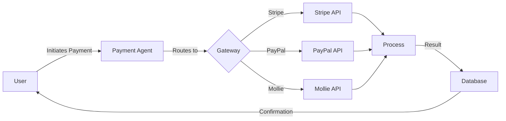

# 🎯 Meal Scavenger Hunt Platform

A scalable, gamified scavenger hunt platform for meal collection, powered by SmythOS agents and deployable on Docker/Hostinger.

## 🌟 Features

### For Hunters
- **Gamified Experience**: Collect meal components from participating shops
- **Team Collaboration**: Form teams and compete together
- **Real-time Leaderboard**: Track progress against other teams
- **QR Code Scanning**: Simple verification at each venue
- **Multi-language Support**: EN/NL with extensibility for more

### For Shop Owners
- **Increased Foot Traffic**: Attract new customers through hunts
- **Analytics Dashboard**: Track visitor statistics and engagement
- **Inventory Management**: Control available items for hunts
- **Marketing Tools**: Built-in promotional features
- **Revenue Generation**: Premium participation packages

### For Organizers
- **Hunt Creation**: Design custom scavenger hunts
- **Team Management**: Organize and approve teams
- **Special Guests**: Celebrate individuals with themed hunts
- **Real-time Monitoring**: Track hunt progress live
- **Flexible Pricing**: Set entry fees and prize pools

## 🚀 Quick Start

### Prerequisites
- Docker 20.10+
- Node.js 18+
- PostgreSQL 15+
- SmythOS API Key

### Installation

```bash
# Clone repository
git clone https://github.com/your-org/meal-scavenger-hunt.git
cd meal-scavenger-hunt

# Configure environment
cp .env.example .env
# Edit .env with your configuration

# Start services
docker-compose up -d

# Initialize database
docker-compose exec backend npm run migrate
```

## 🏗️ Architecture

```
┌─────────────────────────────────────────────────────────┐
│                     Load Balancer                        │
└─────────────┬──────────────────────────┬────────────────┘
              │                          │
    ┌─────────▼──────────┐     ┌────────▼─────────┐
    │   React Frontend   │     │   Backend API    │
    │    (Port 8081/443) │     │   (Port 3527)    │
    └────────────────────┘     └──────┬───────────┘
                                      │
                    ┌─────────────────┼─────────────────┐
                    │                 │                 │
        ┌───────────▼──┐   ┌─────────▼──┐   ┌─────────▼──────┐
        │  PostgreSQL  │   │   Redis    │   │ SmythOS Agents │
        │  (Port 5432) │   │ (Port 3493)│   │  (8001-8005)   │
        └──────────────┘   └────────────┘   └────────────────┘
```

### SmythOS Agents

1. **Clue Generator** - Creates engaging, localized clues
2. **QR Manager** - Handles code generation and validation
3. **Stats Aggregator** - Compiles real-time analytics
4. **Payment Handler** - Multi-gateway payment processing
5. **Notification Service** - Email/push notifications

## 📱 User Flows

### Hunter Flow
1. Register/Login → Join Team → Enter Hunt
2. Receive First Clue → Solve → Navigate to Shop
3. Show QR Code → Employee Scans → Points Awarded
4. Receive Next Clue → Repeat
5. Complete Hunt → Meet at Final Location → Celebrate!

### Shop Owner Flow
1. Register Business → Setup Profile
2. Add Menu Items → Set Fun Facts
3. Join Hunts → Manage Inventory
4. Scan QR Codes → Verify Redemptions
5. View Analytics → Optimize Participation

### Organizer Flow
1. Create Hunt → Set Parameters
2. Invite Shops → Generate Clues
3. Open Registration → Manage Teams
4. Start Hunt → Monitor Progress
5. Award Winners → Generate Reports

## 💳 Payment Integration

### Supported Methods
- **iDEAL** (Netherlands)
- **PayPal** (International)
- **Stripe** (Cards)
- **Sofort** (Germany)
- **Bancontact** (Belgium)

### Payment Flow


## 🔒 Security

### Implementation
- **JWT Authentication**: Secure token-based auth
- **GDPR Compliant**: Full data privacy compliance
- **PCI DSS**: Payment card security standards
- **Rate Limiting**: API protection
- **Input Validation**: XSS/SQL injection prevention
- **SSL/TLS**: End-to-end encryption

### Best Practices
- Regular security audits
- Automated vulnerability scanning
- Secure secret management
- Session management
- Two-factor authentication (optional)

## 📊 Analytics & Monitoring

### Metrics Tracked
- Hunt participation rates
- Shop visit frequency
- Redemption statistics
- User engagement metrics
- Payment success rates
- System performance indicators

### Dashboards
- **Organizer Dashboard**: Hunt management and progress
- **Shop Dashboard**: Visitor analytics and revenue
- **Admin Dashboard**: Platform-wide statistics

## 🌍 Internationalization

### Supported Languages
- 🇬🇧 English (en)
- 🇳🇱 Dutch (nl)
- 🇩🇪 German (de) - planned
- 🇫🇷 French (fr) - planned

### Adding Languages
```javascript
// Add translation files to:
frontend/src/locales/[lang].json
backend/src/locales/[lang].json
```

## 🛠️ Development

### Local Development

```bash
# Backend development
cd backend
npm install
npm run dev

# Frontend development
cd frontend
npm install
npm start

# Run tests
npm test

# Lint code
npm run lint
```

### API Documentation

API documentation available at: `http://localhost:3527/api-docs`

### Key Endpoints

```
POST   /api/auth/register
POST   /api/auth/login
GET    /api/hunts
POST   /api/hunts
GET    /api/teams/:huntId
POST   /api/qr/generate
POST   /api/qr/scan
GET    /api/stats/dashboard
POST   /api/payments/process
```

## 📦 Deployment

### Production Deployment

```bash
# Build production images
docker-compose -f docker-compose.prod.yml build

# Deploy to Hostinger
./scripts/deploy.sh production

# Run migrations
docker-compose exec backend npm run migrate:prod
```

### Scaling

```yaml
# Horizontal scaling in docker-compose.yml
services:
  backend:
    deploy:
      replicas: 3
  frontend:
    deploy:
      replicas: 2
```

## 🐛 Troubleshooting

### Common Issues

| Issue | Solution |
|-------|----------|
| Container won't start | Check logs: `docker-compose logs [service]` |
| Database connection error | Verify credentials in `.env` |
| QR scan failing | Check location services and permissions |
| Payment failing | Verify gateway credentials |
| High memory usage | Run `docker system prune -a` |

## 📝 Contributing

1. Fork the repository
2. Create feature branch (`git checkout -b feature/AmazingFeature`)
3. Commit changes (`git commit -m 'Add AmazingFeature'`)
4. Push to branch (`git push origin feature/AmazingFeature`)
5. Open Pull Request

## 📄 License

This project is licensed under the MIT License - see the [LICENSE](LICENSE) file for details.

## 🤝 Support

- **Documentation**: [/docs](./docs)
- **Issues**: [GitHub Issues](https://github.com/your-org/meal-scavenger-hunt/issues)
- **Email**: support@mealscavengerhunt.com
- **Discord**: [Join our community](https://discord.gg/scavengerhunt)

## 🙏 Acknowledgments

- SmythOS for agent orchestration
- Hostinger for hosting infrastructure
- Open source community for amazing tools
- All contributors and testers

---

**Made with ❤️ for bringing communities together through food and fun!**
